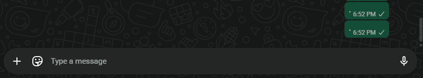

 # AutoCapitalize.ahk

  > System-wide auto-capitalization for Windows - built with AutoHotkey v2.

  Brings mobile-style auto-capitalization to your desktop. Works in Discord, WhatsApp Web, Slack, your browser, and other text fields, while staying out of the way in terminals, editors, and IDEs.

  

  ---

  ## Features

  - **Sentence detection** - Automatically capitalizes the first letter after `. ` `! ` and `? `
  - **New field detection** - Capitalizes the first letter when focus changes to a new text input control
  - **Empty field detection** - Re-capitalizes when you backspace a field down to zero, or use Ctrl+A then Delete/Backspace
  - **Drag-to-select aware** - Handles drag-selection followed by retyping
  - **Paste aware** - Suspends unreliable state after Ctrl+V or Shift+Insert instead of guessing
  - **Low overhead** - Active-window exclusion checks are cached to reduce repeated process lookups

  ---

  ## Excluded by Default

  The script stays passive in the following app categories:

  | Category | Apps |
  |---|---|
  | **Terminals** | Windows Terminal, cmd, PowerShell, pwsh, ConEmu, Git Bash, Alacritty, Hyper, Fluent Terminal |
  | **Text Editors** | Notepad++, Sublime Text, Atom, gedit, Kate |
  | **IDEs** | VS Code, Cursor, Windsurf, Zed, IntelliJ IDEA, PyCharm, WebStorm, CLion, GoLand, Rider, Visual Studio, Eclipse, NetBeans, Android Studio |

  You can add any app by dropping its `.exe` name into the `ExcludedApps` list at the top of the script.

  ---

  ## Requirements

  - Windows 10 or 11
  - [AutoHotkey v2.0](https://www.autohotkey.com)

  ---

  ## Installation

  1. Install AutoHotkey v2.0 from [autohotkey.com](https://www.autohotkey.com)
  2. Download `AutoCaps.ahk` from this repo
  3. Double-click the file to run it - it will appear in your system tray

  **To start automatically with Windows:**
  Press `Win+R`, type `shell:startup`, and drop a shortcut to `AutoCaps.ahk` in that folder.

  ---

  ## Usage

  Once running, the script works silently in the background. You can right-click the tray icon at any time to pause or exit the script.

  ---

  ## Known Limitations

  - **Paste detection** - After pasting, backspace-to-zero tracking is disabled until a hard reset (focus change, Enter, Ctrl+A clear flow, etc.). This is intentional to avoid false capitalizations mid-sentence.
  - **Drag selection behavior** - Drag-selecting text (in non-excluded apps) is treated as replacement input, so the next typed letter may be capitalized.
  - **US keyboard layout** - `!` and `?` are mapped to Shift+1 and Shift+/ respectively. If you use a different keyboard layout, adjust the `~+1` and `~+/` hotkeys accordingly.

  ---

  ## License

  MIT License - see [LICENSE](LICENSE) for details.
